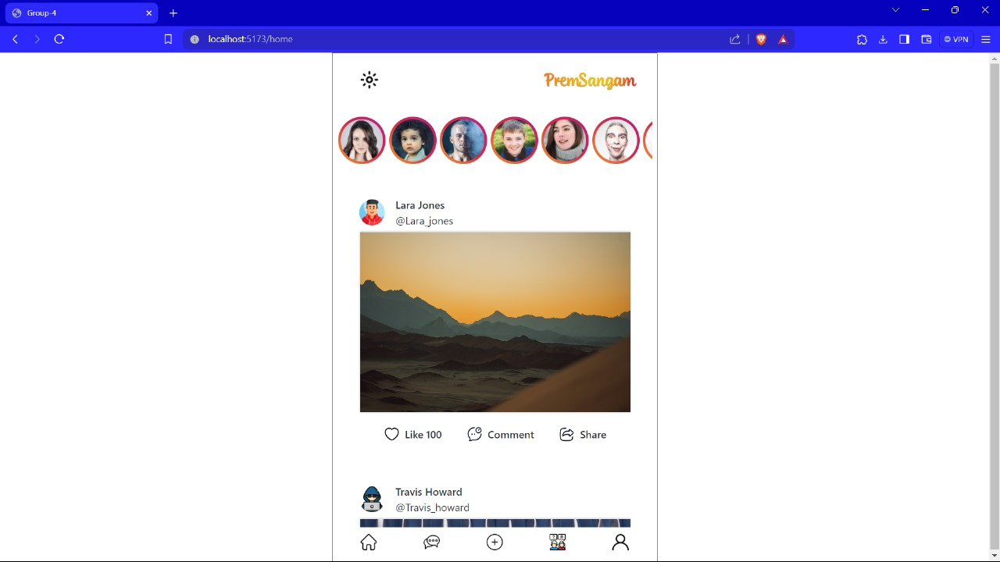
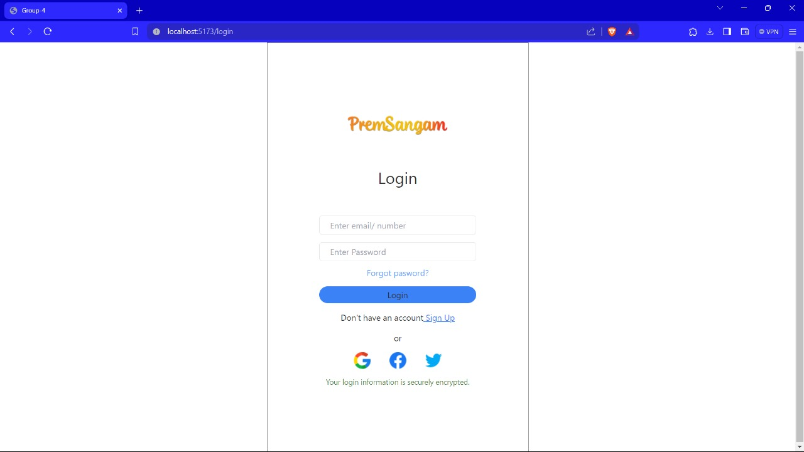
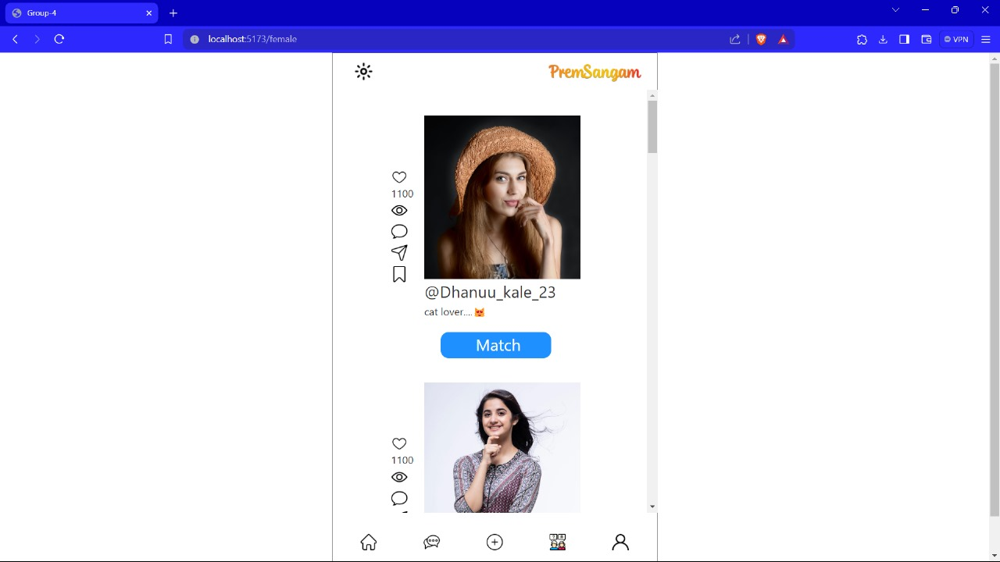
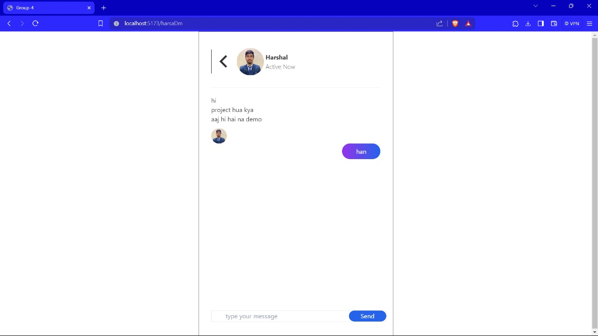

# Premsangam

Premsangam is a social networking platform that combines features from Facebook, Instagram, and various dating apps to create a unique user experience.

## Screenshots

Here are some screenshots of the website:

1. 
2. 
3. 
4. 
5. 
6. 

## Features

- User profiles with customizable information
- Timeline for posts and updates
- Messaging and chat functionality
- Photo and video sharing
- Like, comment, and share posts
- Matching and dating features

## Installation

To run Premsangam locally, follow these steps:

1. Clone this repository.
2. Navigate to the project directory.
3. Install dependencies using `npm install`.
4. Start the server with `npm start`.
5. Access the application in your web browser at `http://localhost:3000`.

## Contributing

Contributions are welcome! If you have any ideas for improvements or new features, feel free to open an issue or submit a pull request.

## License

This project is licensed under the [MIT License](LICENSE).